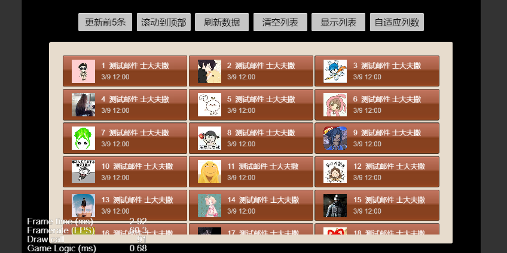
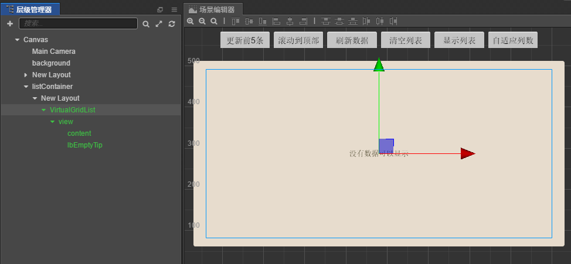
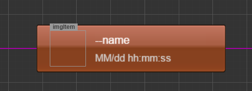

# 一 控件介绍      
CCVirtualGridList是基于Cocos Creator ScrollView + Layout 编写的一个具有**虚拟布局特点**的滚动列表控制容器。支持平滑滚动显示大量数据对象，图片元素可以实现**异步按帧加载**，**保证滚动平滑**。**具有滚动翻页功能**，**自适应宽度显示多列**，**单项选择**，**局部更新**等实用功能。

It's a customized GridList control for cocos creator, with the virtual scrolling layout, smoothly scrolling for millions items.

Cocos Creator 引擎中提供了一个常规的滚动控制容器——ScrollView，实现基本滚动控制。但是缺少与之配合的List控件来实现虚拟布局功能，需要开发者手动扩展，在这里就提供一个实现虚拟布局功能的扩展列表控件，是参照Egret中的List控件的接口方式来实现。



# 二 虚拟布局原理
虚拟布局的原理其实很简单，就是只加载和显示可视区域的列表内容，可视区域外的并没有实体控件被实例化。以滚动事件驱动，动态滚动并复用可视区域内的列表模板，切换数据显示，看上去像一个完整的列表在上下滚动，由于此种设计实例化控件少，所以内存占用极少，drawcall数量低而且稳定，所以现在被普遍应用。但是虚拟布局的核心不仅在于此，由于需要不停地切换显示内容，如何将素材转换的更快速，更平滑才是虚拟列表的关键。CCVirtualGridList在VirtualGridListBaseItem 中提供自己的加载图片的方法——loadImage，实现异步按帧加载，保证列表滚动流畅度，又能有效利用缓存。

# 三 VirtualGridList 使用
使用控件非常简单，只需要拷贝demo项目中三个文件VirtualGridList.prefab，VirtualGridList.js，VirtualGridListBaseItem.js 到您的工程中Prefabs文件夹中即可。使用之前将VirtualGridList.prefab拖入画面中, 列表单元控制组件继承 VirtualGridListBaseItem 就可以。

Copy three files - VirtualGridList.prefab, VirtualGridList.js, VirtualGridListBaseItem.js  into the folder "Prefabs" of your project. Then drag "VirtualGridList.prefab" into the scene. The item template for display extends the class of VirtualGridListBaseItem.

# 四 API说明

## 1. VirtualGridList 启动参数
启动参数可以在creator 图形化界面填入，但是为了不受预制体的维护影响，建议通过初 始化脚本接口传入启动参数。

  ### virtualGridList.initGridList(itemTemplatePrefab, itemComponentName, options?)

  ### 参数
    - itemTemplatePrefab    cc.Prefab   列表单元显示控件
    - itemComponentName     String      列表单元显示控件控制器名称, 必须继承 VirtualGridListBaseItem
    - options? {                     
        paddingTop?: Number             列表距离上边缘距离 默认为0
        paddingBottom?: Number          列表距离下边缘距离 默认为0
        spacingX?: Number               列间距 默认为3
        spacingY?: Number               行间距 默认为3
        columnNum?: Number              列数 默认为0，列数自动适配容器宽度
        useVirtualLayout?: Boolean        是否启用虚拟列表 默认为true
        emptyTip?: cc.String            没有数据显示提示
        cacheImage?: Boolean            通过virtualGridListBaseItem.loadImage()方法加载的
                                          图片，自动缓存，控件回收后，图片缓存将被全部释放。
    }

## 2. VirtualGridList 功能接口
  
  #### createItemsDisplayList(dataList: any[]): void
首次创建显示列表， dataList为数据数组

  #### appendItemsToDisplayList(dataList: any[]): void
追加显示列表， dataList为追加的数据数组，适用于滚动翻页

  #### getDataList(): any[]                    
 获取数据数组

  #### getTemplateItems(): cc.Prefab[]
获取显示对象列表

  #### clearList(): void
 清空列表

  #### findItemDisplayByData(data: any): cc.Prefab
根据数据对象查找对应的显示对象，当开启虚拟列表的时候，返回对象可能不存在

  #### getImageFromCache(key: String): cc.Texture2D
获取缓存图片

  #### addScrollToBottomEventHandler(handler: Function, thisObj: any): void
注册滚动至底部回调方法 当useVirtualList=false 时不可用

  #### refreshItemDisplays(some?: any[]): void
修改数据后，刷新列表显示，some代表指定刷新的对象, 不传则刷新全部。

  #### isTop(): Boolean
 判断是否滚动至顶部

  #### scrollToTop(): void
滚动至顶部

  #### scrollToFixedPosition(itemIndex: Number, sec?: Number): void
滚动到固定位置 itemIndex代表滚动至指定显示对象的索引， sec为滚动动画时长


## 3. VirtualGridListBaseItem 显示单元基类 （必须继承） 接口

  #### data: any
数据对象。来自要显示的数据列表中的一条，每一条显示单元控件，都对应一条数据对象，当useVirtualLayout= true 的时候，单元控件对应的data数据对象不固定，会滚动切换。

  #### dataChanged(): void
子类可覆盖方法，自定义显示方法，当滚动交替或初始化的时候触发。当useVirtualLayout= true 的时候，每一个显示单元控件都是滚动复用的，所以对应的Component组件也是复用的，所以不要在其内部记录与某一条数据对应的变量或属性。
```
dataChanged() {
        this._super();
        const data = this.data;
        this.loadImage(data.pic, this._showImg, this); // 建议所有图片通过loadImage加载，可以自动缓存，并且异步按帧加载，不卡顿
        this.lbItemName.getComponent(cc.Label).string = data.name;
        this.lbDate.getComponent(cc.Label).string = data.date;
    }
```

  #### getItemIndex(): Number
获取现实对象在队列中的索引

  #### onSelect(): void
子类可覆盖方法，点选触发事件，只支持单选

  #### onUnselect(): void
子类可覆盖方法，如果当前为选中状态，当其他单元被点选触发此事件

  #### onLeave(): void
子类可覆盖方法，当控件滑动离开可视区的时候触发 当useVirtualList=false 时不可用

  #### onEnter(): void
子类可覆盖方法，当控件滑动进入可视区的时候触发 当useVirtualList=false 时不可用

  #### loadImage(pic: String, cb: Function, thisObj: any): void
VirtualGridList 提供的异步加载图片, 自动缓存。pic: 图片地址， cb: 图片加载后的回调方法，thisObj: 回调方法this对象

# 五 显示列表
```
initGridList(){
        this._gridListController.initGridList(this.itemTemplate, 'ItemDisplayController', {
            paddingTop: 10,
            paddingBottom: 100,
            spacingY: 5,
            emptyTip: '什么也没有啊',
            columnNum: this._currentColumn,
            useVirtualLayout: true
        });
        this._gridListController.addScrollToBottomEventHandler(this._nextPage, this); //注册翻页事件

        this.showList();
    },
showList(pageNo, itemCount) {
      pageNo = pageNo || 1；
      itemCount = itemCount || 29;
      let list = [];
      let total = pageNo * itemCount;
      let picIndex = 0;
      for (let i = (pageNo - 1) * itemCount + 1; i <= total; i++) {
          picIndex++;
          let item = {
              pic: "avatar/avatar_" + picIndex,
              date: "3/9 12:00",
              name: i + '_测试邮件'
          }
          list.push(item);
      }
      this._dataList = this._dataList ? this._dataList.concat(list) : list; // 滚动翻页需要合并数据数组

      this._gridListController.appendItemsToDisplayList(list);
  }
```
- scene 中放置控件


- 自定义显示单元


- 最终效果

# 六 配合[CCButtonDropdownList](https://github.com/SituDana/CCButtonDropdownList-for-Cocos-Creator)可以扩展实现带有虚拟布局的下拉列表
